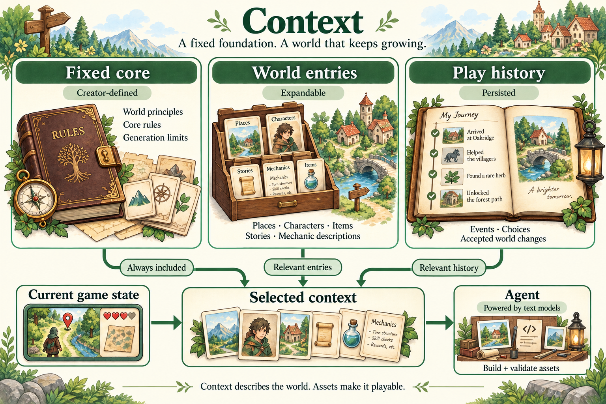

<h1 align="center">
  <a href="https://github.com/openfunlabs"></a>
  OpenFun
</h1>

**English** | [简体中文](README.zh-CN.md)

**OpenFun is an open-source AI game creation and runtime framework for generating an initial world and continuously expanding its content and assets during play.**

Describe the game you want to make, shape its initial world and rules, and let later play develop new places, characters, items, stories, and eventually mechanics. OpenFun is friendly to both people who have never used a game engine and experienced game developers.

[Installation](#installation) · [Usage](#usage) · [Architecture](#architecture) · [Roadmap](#roadmap)

## Installation

You need **Node.js 22.19+** and, for the current version, **Godot 4**. The agent runtime is bundled.

One-command installation is planned once the npm package is published:

```sh
npm install -g --ignore-scripts openfun
```

The package is not published to npm yet. Use the source installation below for now.

<details>
<summary>Install from source</summary>

Install pnpm, then run:

```sh
git clone https://github.com/openfunlabs/openfun.git
cd openfun
pnpm install --frozen-lockfile
pnpm pack --out .output/openfun.tgz
npm install -g --ignore-scripts ./.output/openfun.tgz
```

Packing also builds the project. Skipping dependency install scripts prevents them from changing other clients' configuration.

</details>

## Usage

```sh
openfun setup
mkdir my-world
cd my-world
openfun
```

Use `/login` to sign in and `/model` to choose a model. Describe your game, create its initial world, and use `/play` to open the game window.

| Command                        | Purpose                                      |
| ------------------------------ | -------------------------------------------- |
| `/play`                        | Start the game and local generation service  |
| `/play --generation-budget 24` | Set this session's generation request budget |
| `/stop`                        | Stop the game and generation service         |
| `/world`                       | Inspect the current project                  |
| `/new`                         | Start a new conversation in the same world   |

OpenFun uses the current directory as the world. To switch projects, exit, change directories, and run `openfun` again.

<details>
<summary>Configuration and advanced commands</summary>

- **Models and login:** OpenFun keeps its own profile in `~/.openfun/agent/`; use `OPENFUN_HOME` to change the data root. Authoring and background generation currently use the world's saved model preference. The built-in image tool currently uses OpenFun's Codex login with a Codex conversation model; independent media providers are part of the design below.
- **Tools:** `openfun setup` saves discovered engine paths. Set `OPENFUN_GODOT` for an explicit engine path. Use `/mcp` for MCP services and `/ctx-stats` for Context Mode. Defaults can be configured in `~/.openfun/plugins.json`; the asset-library extension is currently controlled by `assets3d`.
- **Budget:** The default is 12 generation requests per play session, with a range of 0–100. Failed attempts count; zero allows reuse of saved content without new requests.
- **Diagnostics:** `openfun doctor` checks configuration. `/about` shows runtime versions. Use `openfun -- --verbose` for detailed startup output.

Standalone project commands:

```sh
openfun create ./arena --no-chat
openfun check ./arena
openfun preview ./arena --demo
openfun play ./arena
openfun pack ./arena --output ./arena.openfun
openfun import ./arena.openfun ./shared-arena
openfun play ./shared-arena --trust-project
```

Creation starts from a blank project; `--template /path/to/project` selects your own starting project. Current world packages contain the project, generated content, and saves. Imported executable projects require explicit trust. Credentials are excluded from sharing.

Checks and previews make no new model requests. Previews are headless by default; ask the agent to use `world_preview_game` with `mode: "windowed"` for actual rendered frames. Previewing is separate from verifying generation, activation, saving, and recovery during play.

For optional continued refinement, use `/polish [focus]`. Inspect with `/polish status`, pause with `/polish stop`, resume with `/polish resume`, or discard with `/polish discard`. The loop has no fixed round or time limit. It works on a candidate copy, and applying it with `/polish apply` requires a stopped game. Existing saves are preserved.

</details>

## Architecture

The **Agent** uses **Context** to create and extend **Assets**, which the **game engine** runs. The goal is to make the same creative capabilities available during authoring and play.


| Part            | Responsibility                                                                                         |
| --------------- | ------------------------------------------------------------------------------------------------------ |
| **Context**     | Rules, world descriptions, and play history that guide generation                                      |
| **Agent**       | Use text models and tools to plan, generate media, write scripts, compose scenes, and validate updates |
| **Assets**      | Media, executable scripts, and reusable scenes that combine them                                       |
| **Game engine** | Input, simulation, game state, physics, rendering, and activation of prepared updates                  |

### Context: fixed rules and an evolving world

Context stores the world's textual design, rules, and history, separating what generation must preserve from what it can expand. Executable behavior belongs to Assets.



| Part              | What it contains                                                                    | How it changes                                                         |
| ----------------- | ----------------------------------------------------------------------------------- | ---------------------------------------------------------------------- |
| **Fixed core**    | Core world principles, foundational rules, and limits on future generation          | Defined by the creator at epoch0; ongoing generation cannot rewrite it |
| **World entries** | Descriptions of places, characters, items, quests, stories, and permitted mechanics | Created at epoch0, then expanded or updated within the fixed rules     |
| **Play history**  | Events that happened, player choices, and accepted world changes                    | Recorded as play progresses; unplayed drafts are not history           |

Inspired by [SillyTavern's World Info](https://docs.sillytavern.app/usage/core-concepts/worldinfo/), the Agent uses a persistent core plus relevant entries and history selected for the current situation. This saved Context supplies each generation task with the knowledge it needs, alongside current state from the engine.

Gameplay rules are described in Context and enforced by scripts and validation. New mechanics must stay within the fixed core; a creator can deliberately revise that core in a new release. Live state such as health and position remains the responsibility of the engine and saves.

### Assets: media, scripts, and scenes

Assets contain the media and executable implementation of the game, including reusable **scenes (Scene)**.


- **Media:** images, including illustrations, sprites, textures, tiles, and animation frames; video; music and sound effects; and 3D models.
- **Scripts:** executable game mechanics and behaviors, such as movement, combat, interactions, and quest logic.
- **Scenes:** reusable compositions of nodes, media, scripts, and other scenes, defining how their parts are arranged and work together.

In the current Godot implementation, a [scene is a hierarchy of nodes](https://docs.godotengine.org/en/stable/getting_started/step_by_step/nodes_and_scenes.html). Scripts can attach to nodes and remain in shared external files. Textures, audio, scripts, and saved scenes are [resources](https://docs.godotengine.org/en/stable/tutorials/scripting/resources.html), so **Assets** remains the umbrella term; **Nodes** describes the building blocks within scenes.

For example, a character's body, outfit, animations, footsteps, and movement script can form a character scene. Terrain, trees, buildings, and character scenes can form a map region; multiple regions can form a larger scene. These compositions preserve their parts and relationships for reuse. Each scene instance has its own runtime state managed by the engine.

### Initial world and ongoing generation

The creator defines the **Context and Assets of epoch0**, including the rules and constraints for future development. This can be an entire playable world.

During play, player actions and world state inform the Agent's next updates. It prepares and validates new Assets, which the engine activates at a suitable point. Accepted world changes and events update Context, and the results are saved. These updates form later epochs; they can happen independently and reuse unchanged material. The engine keeps running between updates.

Games can organize maps in different ways, such as separate platforming levels or connected regions in an open world. When adding a new mechanic, existing gameplay and saves should keep working. OpenFun keeps track of content prepared for later and what the player has already experienced. Returning to an area or loading a save preserves the existing world and the player's progress.

Publishing is designed around an epoch0 release. Each playthrough creates an evolving world instance with its own later content and saves. A multiplayer instance shares accepted updates and an authoritative world state.

### Agent, engine, and models

The **current agent is built on pi, and the current game runtime uses Godot**. Godot's [MIT license](https://godotengine.org/license/), compact node/scene structure, and [runtime resource loading](https://docs.godotengine.org/en/stable/tutorials/export/exporting_pcks.html) make it a practical starting point. Future versions may migrate to or support other engines as the project develops.

Driven by text models, the Agent reads Context and engine state, calls image, video, audio, and 3D models for new media, and writes gameplay scripts. It uses tools to compose media, scripts, nodes, and existing scenes into playable Assets, validates the result, and prepares it for the engine to load. Suitable existing Assets can be reused throughout this process.

The design supports configuring providers by capability, including local and cloud models. No particular text or media model defines OpenFun. Generation can work ahead of play to balance latency, quality, and cost.

## Roadmap

| Stage                             | Target experience                                                                                                                    |
| --------------------------------- | ------------------------------------------------------------------------------------------------------------------------------------ |
| **2D games**                      | Games in the style of Terraria and Stardew Valley that generate new regions, monsters, items, assets, and stories during play        |
| **Basic 3D games**                | Minecraft-like worlds with new map chunks, monsters, and items, supported by streaming, spatial interaction, and a 3D asset pipeline |
| **High-quality open-world games** | Long-term ambition toward the scale, systemic depth, and presentation of games such as Fallout and GTA                               |

Expand toward roguelites, platformers, card games, and other genres as the foundation matures. Each stage should demonstrate enjoyable play, consistent world state, reliable recovery, and manageable generation costs.

### Local inference

Work toward user-configurable, locally runnable **diffusion models for text, images, video, audio, and 3D** to lower the ongoing cost of play. Adoption depends on model availability, hardware, latency, and quality; cloud providers remain an option.

### OpenFun Cloud

**OpenFun Cloud is the planned UGC platform for creating, publishing, sharing, and playing continuously evolving AI games.**

- Publish, discover, and remix epoch0 releases with their initial Context and Assets.
- Host persistent worlds and multiplayer sessions with shared generation results.
- Provide managed inference for hosted games, including cloud multiplayer.
- Enable mobile creation and play through cloud rendering, with attention to latency, touch controls, bandwidth, and GPU cost.

Cloud services can develop alongside 2D and 3D support. Cloud rendering and model inference are separate capabilities.

## Development

<details>
<summary>Build, test, and internal references</summary>

Use Node.js 22.19+ and the pnpm version pinned in `package.json`:

```sh
pnpm install --frozen-lockfile
pnpm check
pnpm format:check
```

`check` runs type checking, unit/integration tests, and the build. It makes no model calls. Engine acceptance tests and live model tests run separately; model tests consume quota.

Keep personal worlds outside the repository and test output in `.output/`. Keep both READMEs in sync. Runtime protocol and game-design guides remain internal resources used by the agent; [world format](docs/world-format.md) and [evaluation](docs/evaluation.md) are developer references.

</details>

## License

OpenFun is [MIT licensed](LICENSE). Dependencies retain their own licenses; see [third-party notices](THIRD_PARTY_NOTICES.md).
