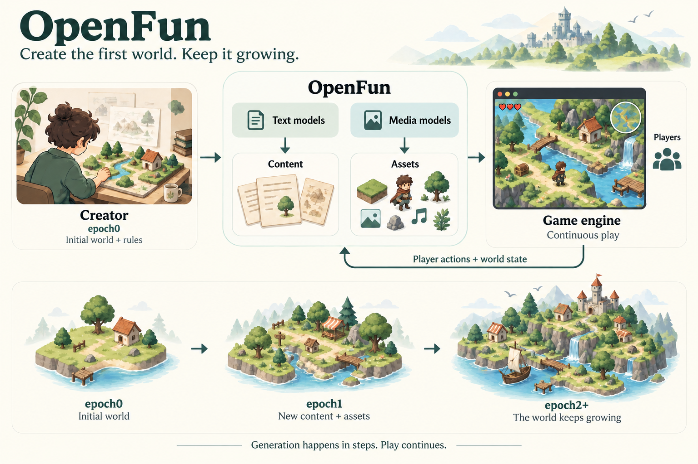

# OpenFun

[English](README.md) | **简体中文**

**OpenFun 是一个开源 AI 游戏创作与运行框架，用于生成初始世界，并在游玩过程中持续扩展游戏内容与资产。**

描述你想制作的游戏，塑造初始世界和规则，让后续游玩逐步发展出新的地点、角色、道具、剧情，乃至游戏机制。OpenFun 对从未使用过游戏引擎的普通用户和有经验的游戏开发者都十分友好。

[安装](#安装) · [使用](#使用) · [架构设计](#架构设计) · [Roadmap](#roadmap)

## 安装

需要 **Node.js 22.19+**；当前版本还需要 **Godot 4**。Agent 运行环境随包安装。

npm 包发布后，计划通过一行命令安装：

```sh
npm install -g --ignore-scripts openfun
```

目前尚未发布到 npm，请先使用下面的源码安装方式。

<details>
<summary>从源码安装</summary>

安装 pnpm 后运行：

```sh
git clone https://github.com/openfunlabs/openfun.git
cd openfun
pnpm install --frozen-lockfile
pnpm pack --out .output/openfun.tgz
npm install -g --ignore-scripts ./.output/openfun.tgz
```

打包会自动构建项目。跳过依赖安装脚本，可避免它们修改其他客户端的配置。

</details>

## 使用

```sh
openfun setup
mkdir my-world
cd my-world
openfun
```

用 `/login` 登录，通过 `/model` 选择模型。描述你的游戏，创作初始世界，再用 `/play` 打开游戏窗口。

| 命令                           | 用途                       |
| ------------------------------ | -------------------------- |
| `/play`                        | 启动游戏和本地生成服务     |
| `/play --generation-budget 24` | 设置本次游玩的生成请求预算 |
| `/stop`                        | 停止游戏与生成服务         |
| `/world`                       | 查看当前项目信息           |
| `/new`                         | 在同一世界中开始新对话     |

OpenFun 将当前目录作为游戏世界。切换项目时，退出程序、切换目录，再运行 `openfun`。

<details>
<summary>配置与进阶命令</summary>

- **模型与登录：** OpenFun 使用独立的 `~/.openfun/agent/` 配置；可通过 `OPENFUN_HOME` 更改数据目录。创作与后台生成当前使用世界中保存的模型偏好。内置生图工具目前使用 OpenFun 的 Codex 登录和 Codex 对话模型；独立配置媒体 provider 是下文的设计方向。
- **工具：** `openfun setup` 保存发现的引擎路径，也可用 `OPENFUN_GODOT` 指定路径。通过 `/mcp` 管理 MCP 服务，`/ctx-stats` 查看 Context Mode。默认扩展可在 `~/.openfun/plugins.json` 中配置，素材库扩展当前由 `assets3d` 控制。
- **预算：** 每次游玩默认允许 12 次生成请求，可设置为 0–100。失败尝试也计入预算；设为 0 时可复用已保存内容，不发起新请求。
- **诊断：** `openfun doctor` 检查配置，`/about` 显示运行环境版本，`openfun -- --verbose` 显示详细启动信息。

独立项目命令：

```sh
openfun create ./arena --no-chat
openfun check ./arena
openfun preview ./arena --demo
openfun play ./arena
openfun pack ./arena --output ./arena.openfun
openfun import ./arena.openfun ./shared-arena
openfun play ./shared-arena --trust-project
```

新项目从空白工程开始；使用 `--template /path/to/project` 可选择自己的起始项目。当前世界包包含项目、已生成内容与存档；执行导入的项目需要显式信任。分享包不包含登录凭据。

检查与预览不发起新的模型请求。预览默认采用 headless 模式；需要实际渲染画面时，可让 Agent 使用 `world_preview_game` 的 `mode: "windowed"`。预览与验证游玩中的生成、启用、保存和恢复是不同的步骤。

需要持续打磨时，可使用 `/polish [focus]`，通过 `/polish status` 查看、`/polish stop` 暂停、`/polish resume` 恢复，或 `/polish discard` 放弃。该循环不设固定轮次或时长，在候选副本中工作；使用 `/polish apply` 应用修改时需要先停止游戏，已有存档会保留。

</details>

## 架构设计

设计围绕 **内容、资产和游戏引擎** 展开，目标是让创作阶段和游玩阶段具备相同的创作能力。



| 部分         | 职责                                                            |
| ------------ | --------------------------------------------------------------- |
| **内容**     | 世界设定、规则、机制、行为代码、角色、道具与剧情                |
| **资产**     | 图片、动画、音频、视频、3D 资源，以及它们组成的场景、地图与分区 |
| **游戏引擎** | 输入、模拟、游戏状态、物理、渲染，以及启用已准备好的更新        |

### 初始世界与持续生成

创作者定义 **epoch0** 的内容、资产和规则，以及后续世界发展的约束。它可以是一个完整的可玩世界。

游玩过程中，玩家行为和世界状态驱动后续更新：生成内容与资产，准备和验证它们，在合适的时机启用，再持久化结果。这些更新形成后续 epoch，可以独立推进并复用未变化的内容，引擎则在更新之间持续运行。

不同游戏可以用不同方式组织地图，比如横版游戏的一个个关卡，或开放世界中相互连接的区域。增加新玩法时，要确保已有玩法和存档还能正常使用。OpenFun 会分别记录提前生成但玩家还没玩到的内容，以及玩家已经经历的事情。回到旧区域或读档时，游戏会保留此前生成的世界和玩家进度。

发布以 epoch0 版本为基础。每次游玩建立一个持续演化的世界实例，拥有后续内容与存档；多人实例则共享已接受的更新和统一的权威世界状态。

### Agent、引擎与模型

**当前 Agent 基于 pi 开发，当前游戏运行环境基于 Godot。** Godot 的 [MIT 许可证](https://godotengine.org/license/)、紧凑的节点与场景结构，以及 [运行时资源加载](https://docs.godotengine.org/en/stable/tutorials/export/exporting_pcks.html) 能力，使它成为实用的起点。随着项目发展，未来也可能迁移或兼容其他游戏引擎。

文本模型生成内容、逻辑和生成指令。新的媒体资产通过图片、视频、音频和 3D 生成模型制作，也可以复用合适的已有资产。代码负责逻辑、布局、碰撞与整合。

设计上支持按能力配置不同 provider，包括本地与云端模型，不将 OpenFun 绑定到某个特定文本或媒体模型。生成可以提前于游玩需求推进，以平衡延迟、质量和成本。

## Roadmap

| 阶段                     | 目标体验                                                                         |
| ------------------------ | -------------------------------------------------------------------------------- |
| **2D 游戏**              | 泰拉瑞亚、星露谷物语风格的游戏，在游玩中生成新地图分区、怪物、道具、资产与剧情   |
| **基础 3D 游戏**         | 类似我的世界，持续生成新地图块、怪物和道具，建立区块加载、空间交互与 3D 资产流程 |
| **高质量的开放世界游戏** | 长期向辐射、GTA 等游戏的规模、系统深度和表现力发展                               |

随着基础能力成熟，逐步扩展到肉鸽、横版闯关、卡牌等更多游戏类型。每个阶段都应验证游玩体验、世界状态一致性、可靠恢复和可控的生成成本。

### 本地推理

逐步支持用户配置、可在本地运行的 **文本、图像、视频、音频和 3D diffusion 模型**，降低持续游玩的成本。具体采用取决于模型可用性、硬件、延迟和质量，云端 provider 仍是可选方案。

### OpenFun Cloud

**OpenFun Cloud 是规划中的 UGC 平台，让用户创作、发布、分享和游玩持续演化的 AI 游戏。**

- 发布、发现和再创作 epoch0 版本，包含初始内容、资产与规则。
- 托管持久化世界和多人会话，共享生成结果。
- 为托管游戏提供推理服务，包括云端多人游戏。
- 通过云渲染支持移动端创作与游玩，并关注延迟、触控、带宽和 GPU 成本。

Cloud 服务可以与 2D、3D 能力同步发展。云渲染和模型推理是两种独立能力。

## 开发

<details>
<summary>构建、测试与内部资料</summary>

使用 Node.js 22.19+，以及 `package.json` 中指定版本的 pnpm：

```sh
pnpm install --frozen-lockfile
pnpm check
pnpm format:check
```

`check` 包含类型检查、单元与集成测试和构建，不调用模型。引擎验收与真实模型测试单独运行，模型测试会消耗额度。

个人世界放在仓库之外，测试输出放在 `.output/`，公开说明同步更新中英文 README。运行时协议和游戏设计指南保留为 Agent 使用的内部资源；[世界格式](docs/world-format.md) 和 [评测规范](docs/evaluation.md) 供开发参考。

</details>

## 许可证

OpenFun 使用 [MIT 许可证](LICENSE)。依赖保留各自许可证，详见 [第三方声明](THIRD_PARTY_NOTICES.md)。
