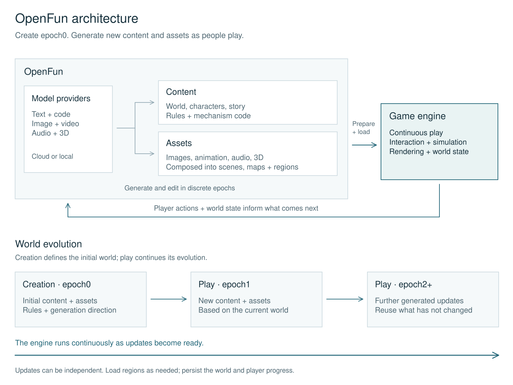

# Architecture

OpenFun manages a game's content and assets from its initial world (**epoch0**) through ongoing generation during play. Godot runs the game. This document describes the target architecture; [implementation.md](implementation.md) records the current prototype and its limitations.

[Editable Excalidraw source](diagrams/architecture.excalidraw)

## Three parts

| Part        | Responsibility                                                                                                      |
| ----------- | ------------------------------------------------------------------------------------------------------------------- |
| **Content** | World settings, rules, mechanics and behavior code, characters, items, progression, and narrative.                  |
| **Assets**  | Images, animation, audio, video, and 3D resources, plus their composition into scenes, maps, and connected regions. |
| **Engine**  | Input, simulation, gameplay state, physics, rendering, and activation of prepared content and assets.               |

OpenFun coordinates generation and persistence around these parts. Player actions and world state feed the next generation request. A map may be a graph, tile grid, chunked space, or another representation suitable for the game; the architecture does not prescribe one format for every genre.

## Epoch0 and continuous play

The creator authors **the content, assets, and rules at t0**, including the initial world and the constraints for its future development. Epoch0 can contain a whole playable world; its scope belongs to the creator.

Later epochs represent committed content and asset updates. They may add a region, monster, item, story, or mechanic while reusing everything unchanged. Content and asset generation can proceed independently; an epoch is neither a simulation tick nor a requirement to regenerate the whole world.

The engine runs continuously. Generation works ahead of the player where possible:

1. Read world rules, player consequences, and relevant existing content.
2. Generate a candidate update and prepare its assets.
3. Validate compatibility and activate it at a suitable gameplay boundary.
4. Persist the accepted update and subsequent player state.

An unfinished or failed request leaves the current playable world available. Prepared content is distinct from content the player has encountered; revisits and restored saves reuse committed results. New mechanics require code validation and state compatibility, as well as asset loading.

**The long-term goal is creative parity between authoring and play**, including new scripts and mechanics. The current runtime worker only generates structured data for existing scripts and assets. The separate polish workflow still requires the game to stop before applying code changes.

## Models and assets

Text/code models produce content, logic, and generation instructions. Media models produce new images, video, audio, and 3D assets; existing suitable assets can also be reused. Code handles composition, layout, collision, and integration. Hand-coded artwork is not a substitute for a media generation pipeline.

Providers should be independently configurable by capability, with local and cloud backends behind the same conceptual boundary. Model names and providers are configuration choices. Latency, quality, and cost determine which tasks run ahead of play. Local diffusion models are a research and delivery direction in the [roadmap](roadmap.md), subject to actual hardware and quality results.

## Why Godot

Godot is the first supported engine; a general multi-engine adapter layer can wait until a concrete need justifies it.

- **Open source:** Godot's [MIT license](https://godotengine.org/license/) fits OpenFun's MIT direction and permits customization and redistribution with the required notices. [Unity](https://unity.com/legal/editor-terms-of-service/software) and [Unreal](https://www.unrealengine.com/eula/unreal) use their own engine licensing terms rather than MIT.
- **Simple composition:** Godot's [nodes, scenes, and resources](https://godotengine.org/features/) give generated projects a relatively compact, composable structure. We expect this to make inspection, extension, and recovery from malformed generated assets easier; that is an engineering hypothesis to validate.
- **Integration potential:** A relatively small distribution and modular source make bundling, custom builds, and deeper integration worth exploring. The current CLI launches a separately installed Godot process; it does not embed the engine.
- **Runtime loading:** Godot supports [loading external files](https://docs.godotengine.org/en/stable/tutorials/io/runtime_file_loading_and_saving.html) and [resource packs](https://docs.godotengine.org/en/stable/tutorials/export/exporting_pcks.html) at runtime. OpenFun must still prepare platform-compatible resources, activate scene/script changes, and preserve live state; loading a pack alone does not solve hot updates.

Godot gives us a focused path from 2D to 3D. Performance, mobile exports, and large-world scale will be validated at each milestone rather than assumed from engine choice.

## Releases and world instances

The planned publishing unit is an **epoch0 release**: initial content, assets, rules, and generation configuration, excluding private credentials. Playing a release creates a world instance that develops its own later epochs and saves. Sharing an evolved save is a separate operation.

A multiplayer instance shares an authoritative world state and ordered activation of generated updates. Clients consume the same accepted results. This preserves the epoch model while adding synchronization and authority; the prototype is currently local and single-player.

Delivery stages, including the planned cloud platform, are in the [roadmap](roadmap.md#openfun-cloud-and-ugc).
